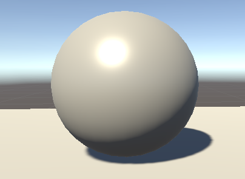

# CMPM163Labs
Lab folder for all CMPM163 assignments

## Lab 2
Video Link: https://drive.google.com/file/d/1-dZi7MJLJZeo0DjhtaYiLRFxRfk4IQVu/view?usp=sharing

## Lab 3
Video Link: https://drive.google.com/open?id=1GQF1pTJrJmd04uPCXmT4W7J6Vj1LPf_v

For the first cube on the left I created a sky blue cube with lambert material and changed the emission to a red color.

For the second cube is a phong material cube with a green shine

For the third cube, it is an interpolation of spring bud and sky blue using the uVu's z coordinate 

For the fourth cube it is an interpolation of interpolating Olive and Dark Cyan using the uVu's z coordinate and interpolating Citrus and Iris Blue using the uVu's y coordinate using the uVu's x coordinate.

## Lab 4
Answers to 24:
a) 8 * u
b) 8 - (8 * v)
c) (3,6) white
Video Link: https://drive.google.com/open?id=1xsqtdokK5F1LJxs5c40K1sAZj9nfT7Sy

The left-most cube is just a cube using the texture 197 without the normal texture

The center-most cube is the same texture as the left-most cube except it has the normal texture

The cube above the center-most cube is texture 191 with the normal texture

The right-most cube is texture 165 using a separate vertex shader and fragment shader

The cube above the right-most cube is a texture 176 tiled into a 2x2 grid. I managed this by scaling the tile down by multiplying it by a vec2(2), then essentially grabbing the portion of the texture that I wanted and pasting them to the other three spaces of the cube by moving texture by either a vec2(1), vec2(1,0), or vec2(0,1) since the texture was scaled by a vec2(2).

## Lab 5
Video Link: https://drive.google.com/open?id=1X6srcxjrFje3E1IAuJ5PoOdigkglOaBZ

The things that I changed from the tutorial was the particle color to be Red. I also applied the particle systems symmetrically. The additional modification to the game that I made was making the track longer, and adding a shortcut ramp to avoid having to go the long way down through the other spiral. 

## Lab 6
A point light is a point in space that sends light out in all directions equally.
A spot light is similar to a point light but has a specified location and range over which the light falls off with a cone-shaped region of illumination. 
A directional light behaves like the sun and can be thought of light sources that exist infinitely far away and always shines in the same direction without diminishing, as it is infinitely far away.
Area lights are defined by either a rectangle or disc that shines light in is a uniform direction across its surface area in only one direction. 

I made my material by using the standard shader and moving the metallic and smoothness sliders until I achieved my desired effect of an aluminum-like material on soda cans.

For the textures I just grabbed 2 different textures from the Unity Asset store. The ones that I used for the walls has the color map, normal map, occulsion map, and a height map for full details. The one that I used for the floor just has a color map without any normal maps. 

## Lab 7 

video Link: https://drive.google.com/open?id=1FO-yD7MjAQgUypvi-lSSHF6CJ91oo0Br

My partner Quan Gao completed Part 2 of the lab.

The part he found most challenging was placing the objects. They wanted to make sure that what they were creating was similar to something that anyone would be able to see in the real world and something that just looked good with the right lighting angle.

The most interesting part for them was the feeling of moving the scene around with the camera. Being able to explore their creation from different angles and views made it feel like they were immersed into a different world, especially after they added their custom skyline clouds.